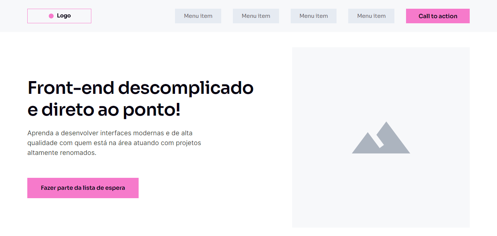
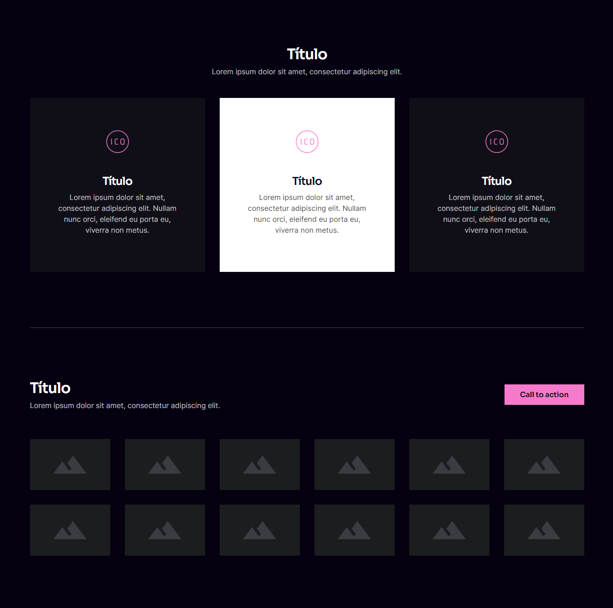
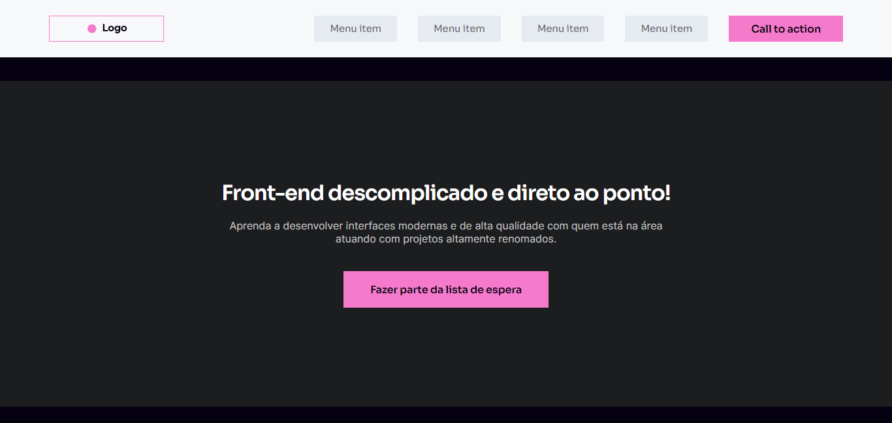
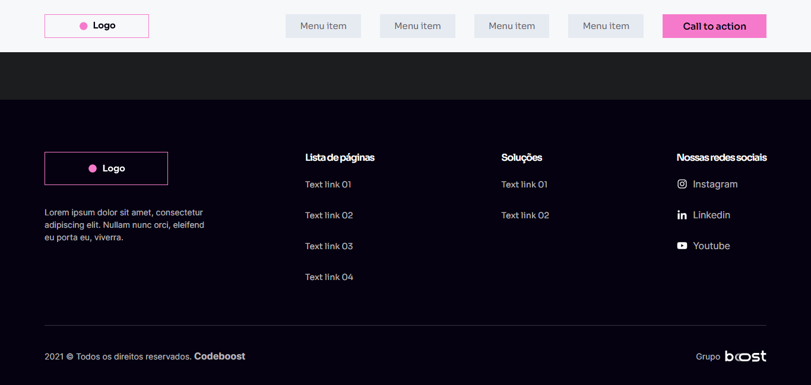

# WireFrame

# Sobre o projeto

https://wireframe-cb-project.netlify.app/

WireFrame responsiva construída durante o curso Cdeboost, com o objetivo de colocar em praticar as minhas habilidades em HTML e CSS.

# Tecnologias utilizadas

## Front end
- HTML
- CSS

# Autora

Lorena Lima

https://www.linkedin.com/in/lorena-lima-b79a32186/

## Imagens

